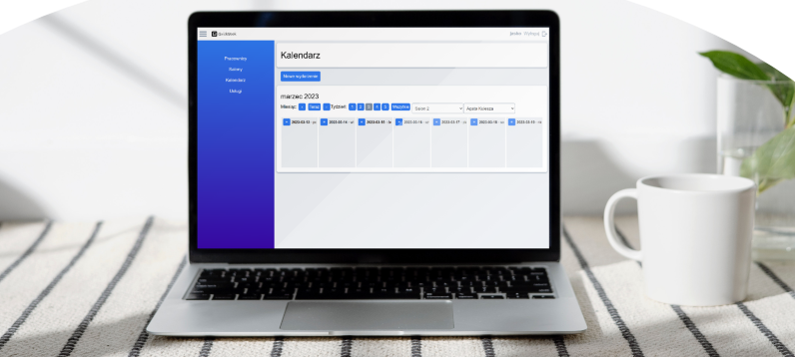
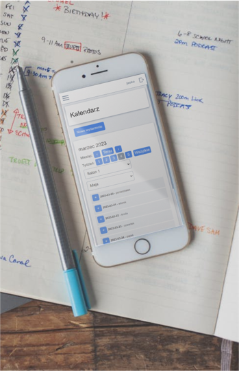

**Quickbook** jest aplikacją webową służącą do zapisywania wizyt w salonie fryzjerskim.

## Funkcje

- Możliwość bookowania wizyt
- Dodawanie i usuwanie salonów (obsługa wielu salonów jednocześnie)
- Dodawanie i usuwanie pracowników
- Nadawanie pracownikom określonych uprawnień zarządzania aplikacją
- Wyświetlanie przyszłych wizyt w widoku tygodniowym i miesięcznym
- Filtrowanie wizyt względem salonu i pracownika
- ...

Więcej funkcji wkrótce! Błędy lub pomysły na nowe funkcje proszę zgłaszać [issue tracker](https://github.com/House079/adzf_sda/issues)

## Wersja testowa

Instrukcja do uruchomienia wersji testowej aplikacji:

TODO

## Preview

Wersja desktopowa

  

Wersja mobilna

  

